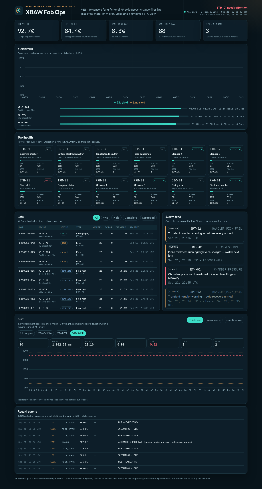
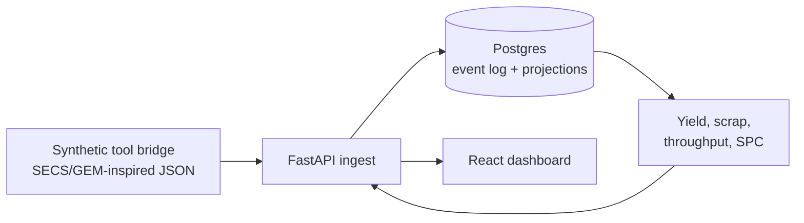

# XBAW Fab Ops

Portfolio demo of a **MES-lite** stack for a fictional RF bulk-acoustic-wave (XBAW) filter line. It ingests SECS/GEM-inspired tool events, stores them in SQL, and reports yield, scrap, throughput, and a simplified SPC view.

**Harborline RF Line 2 is invented.** This project is not affiliated with SpaceX, Starlink, or Akoustis, and it does not contain proprietary process recipes, tool logs, or product specifications. Tool models, spec windows, and lot history are synthetic.

Built by [Gyan Mistry](https://github.com/misty6g).



## What you can do with it

- Watch a seeded line: die yield, line yield, wafer scrap, and wafers per day
- See tool state along the route, including an etch tool sitting in alarm
- Browse lots (WIP, hold, complete, scrapped) and an alarm feed
- Inspect an individuals-style SPC chart for thickness, resonance, and insertion loss
- Post a new event and read it back from the API

The first boot loads about two weeks of deterministic history, so the dashboard is populated immediately. With Compose, a small live simulator then toggles a few non-critical tools and transient warnings without changing lot yield.

## How this maps to fab software

| Manufacturing concern | In this demo |
| --- | --- |
| Process automation | Tool process states (`IDLE`, `SETUP`, `EXECUTING`, `PAUSE`, `ALARM`, `DOWN`), alarm set/clear, and lot track-in / track-out / hold / scrap |
| Equipment integration | JSON collection events with a `ceid`, standing in for SECS/GEM S6F11 reports and S5F1 alarms. A real bridge would translate HSMS; this app starts at the JSON boundary |
| Manufacturing data | Append-only `process_events` log plus relational projections: lots, moves, alarms, measurements, spec limits |
| Reporting | Yield (die and line), wafer scrap, tool throughput, and Cp/Cpk |
| Data stores | Postgres in Compose, SQLite for local runs and tests |
| Delivery | FastAPI, React, Docker Compose |



## KPI definitions

Numbers are computed in `backend/app/services/metrics.py` and covered by pytest.

- **Die yield** = good die / tested die at final test. Wafers that never reach test are excluded.
- **Line yield** = good die / (wafers started × die per wafer). Scrapped wafers count as lost die, so line yield falls when die yield does not.
- **Wafer scrap rate** = scrap wafers / wafers started, for lots closed in the window.
- **Throughput** = wafers leaving final test / window hours. The dashboard also shows that rate as wafers per day.
- **Step yield** = wafers out / wafers in for track-out and scrap moves on that tool.
- **Utilization** = fraction of the window spent in `EXECUTING`.
- **SPC** uses the sample standard deviation (n − 1). Control limits are mean ± 3σ. This is an individuals-chart approximation, not a moving-range I-MR chart. Cp needs both spec limits and a non-zero sigma. Cpk uses whichever spec limits exist.

The seeded history includes a thickness excursion and a few fully scrapped lots, so line yield and the thickness chart move. Spec limits are fictional.

## Event contract

Three JSON Schema documents describe the ingest envelope:

- [`schemas/tool_state.schema.json`](schemas/tool_state.schema.json) — process-state change (CEID 1001)
- [`schemas/alarm.schema.json`](schemas/alarm.schema.json) — alarm set/clear (CEID 2001 / 2002)
- [`schemas/lot_move.schema.json`](schemas/lot_move.schema.json) — track-in, track-out, scrap, hold, optional metrology (CEID 3001–3004)

Examples live in [`schemas/examples/`](schemas/examples/). Replays of the same `event_id` are acknowledged and ignored.

```bash
curl -s -X POST localhost:8000/api/events \
  -H 'content-type: application/json' \
  -d @schemas/examples/alarm_set.json
```

Route steps, in order: incoming, bottom electrode, piezo deposition, top electrode, lithography, etch, frequency trim, RF probe, dice, final test.

Recipes on the demo line: `XB-C-2G4` (connectivity), `XB-N77` (cellular), `XB-S-KU` (satellite). Names refer to public band classes only.

## Run with Docker

Requires Docker Compose v2.

```bash
docker compose up --build
```

- Dashboard: http://localhost:8080
- API docs: http://localhost:8000/docs
- Health: http://localhost:8000/api/health

Postgres credentials in `docker-compose.yml` (`fab` / `fab`) are for this local demo only. The API waits until Postgres is ready, creates tables, and seeds history when the event log is empty.

Reset the demo database:

```bash
docker compose down -v
```

## Run locally

Python 3.11+ and Node 20+ (tested on 3.12 and 22).

```bash
python -m venv .venv
source .venv/bin/activate
pip install -r backend/requirements-dev.txt
make test

# API on :8000, SQLite file backend/xbaw.db, seed on startup
make api

# second shell — dashboard on :5173, proxies /api
make web
```

Copy `.env.example` if you want to point the API at Postgres instead of SQLite. Set `SIMULATOR_ENABLED=true` to turn on the live tool/alarm tick (Compose does this by default).

## Tests

```bash
pytest
```

Coverage is aimed at the KPI math, SPC limits, event validation, idempotent ingest, lot projection, and a short seeded history. CI runs the same suite in [`.github/workflows/test.yml`](.github/workflows/test.yml).

## API

| Method | Path | Purpose |
| --- | --- | --- |
| GET | `/api/health` | Liveness, including a database ping |
| GET | `/api/meta` | Line catalog and disclaimer |
| POST | `/api/events` | Ingest one event |
| POST | `/api/events/batch` | Ingest up to 500 events, one transaction |
| GET | `/api/events` | Recent events |
| GET | `/api/lots` | Lot board (`status` filter) |
| GET | `/api/tools` | Tool health, utilization, step yield |
| GET | `/api/alarms` | Alarm feed (`open_only`) |
| GET | `/api/kpis/summary` | Yield, scrap, throughput |
| GET | `/api/kpis/yield-trend` | Daily yield |
| GET | `/api/kpis/yield?group_by=recipe` | Yield by recipe |
| GET | `/api/kpis/spc` | SPC for one metric |

Interactive docs: `/docs`.

## Layout

```
backend/app/domain/catalog.py      fictional tools, recipes, spec windows
backend/app/services/ingest.py     validate and project events
backend/app/services/metrics.py    pure yield / SPC math
backend/app/services/generator.py  deterministic history
backend/app/services/queries.py    dashboard rollups
frontend/src                       React dashboard
schemas/                           JSON Schema contracts
docker-compose.yml                 Postgres + API + nginx
```

## License

[MIT](LICENSE) © 2026 Gyan Mistry
